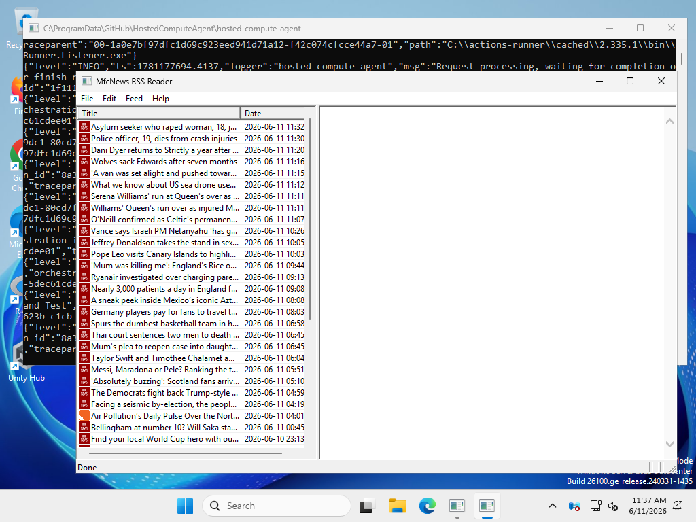
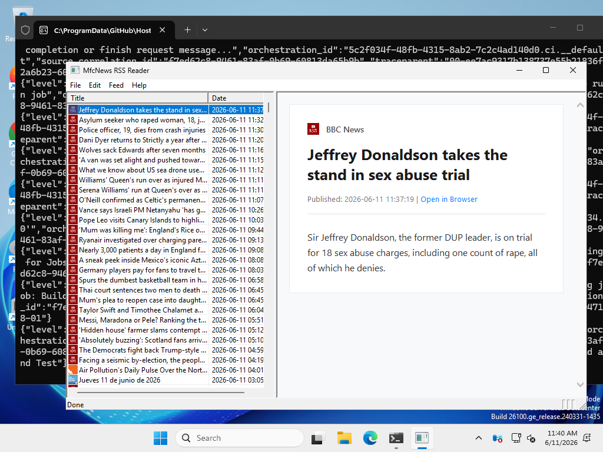
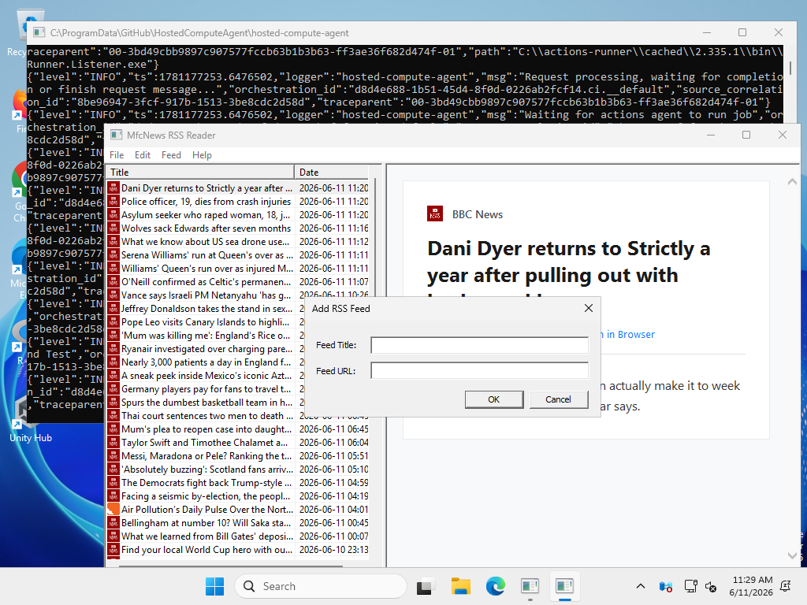
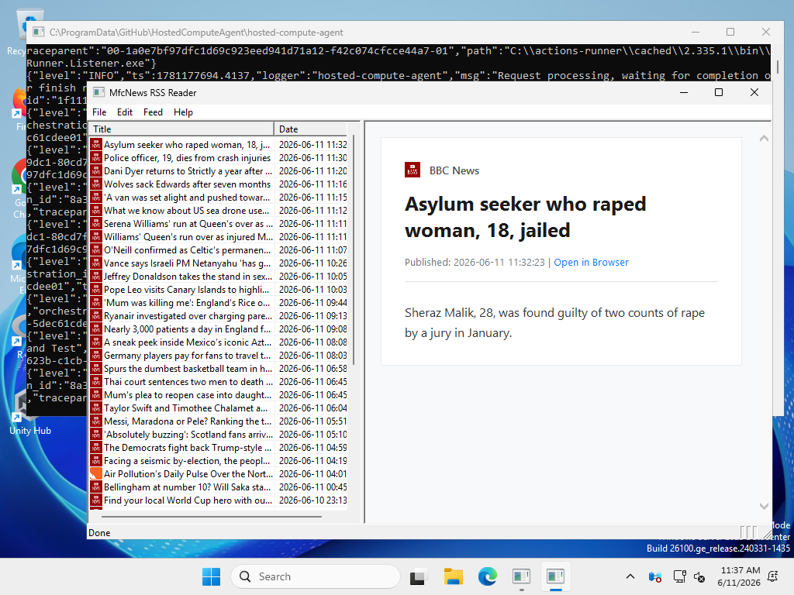

# MfcNews RSS Reader

[](https://github.com/ignacionr/mfc-news/actions/workflows/ci.yml)
-blue)


An elegant Microsoft Foundation Classes (MFC) single-document interface (SDI) RSS News Reader. Built with modern C++20, static linking, and robust error handling to run smoothly on Windows and macOS (via Wine/CrossOver).

---

## 📸 UI Walkthrough & Snapshots

Here is the step-by-step execution flow captured automatically by the CI test runner:

### 1. Initial Load & Startup Feeds
When launched, the application automatically loads default premium RSS feeds (BBC News and NASA Breaking News) to populate the feed item list instantly.


### 2. Article Reading View
Selecting any article from the left pane updates the details pane on the right, presenting the extracted summary and article metadata.


### 3. Adding Custom Feeds
Users can easily expand their news feed collection. Pressing `Ctrl+A` pops up the **Add RSS Feed** dialog window.


### 4. Merged Feed Reload
After adding a new feed, the system automatically fetches, parses, and merges the new articles chronologically (newest first).


---

## 🚀 Key Features

*   **Splitter Window Layout:** Classic and robust layout separating the articles index and the reader details.
*   **Background Fetching & Parsing:** Multi-threaded internet requests using `CInternetSession` and `CHttpFile` with robust fallback handling to bypass connection drops.
*   **Custom RSS Parser:** Fast XML parsing logic built on top of `tinyxml2` supporting RSS/Atom tags and media enclosures.
*   **Media Link Extraction:** Extracts images and media attachments from HTML markup automatically.
*   **Keyboard Shortcuts:** Full accelerator mapping for seamless navigation (e.g., `Ctrl+A` for adding feeds, `F5` to refresh).

---

## 🛠️ Build and Setup

### Prerequisites
*   **CMake** (version 3.20 or newer)
*   **MSVC** (with MFC components installed)
*   **vcpkg** (for dependency resolution)

### Build Command
Run the following commands to configure and build the static release executable:
```cmd
cmake -B build -S . -DCMAKE_TOOLCHAIN_FILE=C:/vcpkg/scripts/buildsystems/vcpkg.cmake -DVCPKG_TARGET_TRIPLET=x64-windows-static
cmake --build build --config Release
```

---

## 🧪 Automated Testing
UI automation tests run on every push using PowerShell and Windows GUI Automation to simulate key interactions, capture screenshots, and verify graceful app closing:
```powershell
.\scripts\automate_ui.ps1
```
